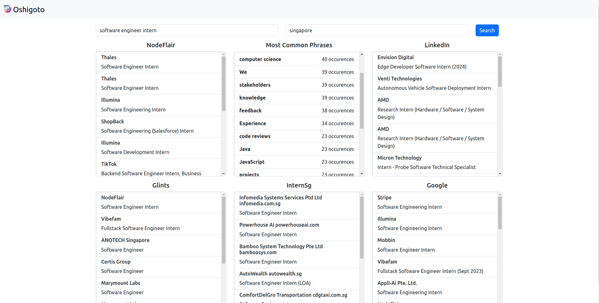

# oshigoto
A webscraper that scrapes various job listing sites for insights into various roles



## Technologies Used
**Frontend**
* Framework: Vue
* Build Tool: Vite

**Backend**
* API: Django
* Scraper: Selenium
* Word Processor: Spacy

## Installation
Clone the Github repo with the command:
```
git clone https://github.com/wrewsama/oshigoto.git
```

## Usage
1. Ensure you have `docker` and `docker-compose` installed
2. `cd` into the repository foldier with
```
cd oshigoto
```
3. Run the application with:
```
docker compose up -d
```
4. The application will start up on `localhost:80`
5. Shut the app down with
```
docker compose down
```

## Credit
Andrew Lo Zhi Sheng 

[](https://github.com/wrewsama)
[](https://www.linkedin.com/in/andrewlozhisheng/)